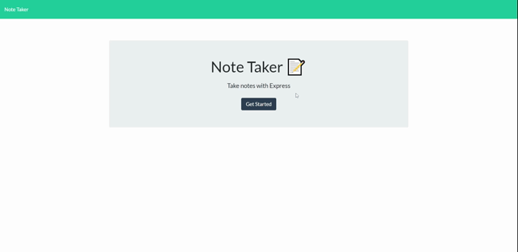

# Jot That Down!

## Description

This application is intended to help users keep track of items or list or even ideas.

## Table of Contents

* [Features](#Features)
* [Links](#Links)
* [Demo](#Demo)
* [Language](#Language)
* [Installation](#Installation)
* [Reference](#Reference)
* [Contribute/Credits](#Contribute/Credits)
* [License](#License)

## Features
Main Features: 
- [x] Users can add title and a section for notes
- [x] Users can save their notes
- [x] Users can refresh the the website and the information retains.

## Links

* Project Repo: [Repository](https://github.com/jeishu/jot-that-down)
* Deployed Site: [Website](https://jot-that-down.herokuapp.com/)
* Video Demo: [Demo]()

## Demo



## Language

* JavaScript
* HTML
* CSS

## Installation

Install Node Modules folder
```
npm i
```

Install Dependencies
```
npm i uuid
npm i express
```

## Reference

These are websites I used to aid me in making my portfolio.

> - [Developer Mozilla](https://developer.mozilla.org/en-US/)
> - [W3School](https://www.w3schools.com/) 
> - [StackOverflow](https://www.stackoverflow.com/) 

These websites aid me in creating this README.

> - [GitHub Docs](https://docs.github.com/en/free-pro-team@latest/github/writing-on-github/basic-writing-and-formatting-syntax) || Learn most of my README syntax here.
> - [Akash Nimare](https://medium.com/@meakaakka/a-beginners-guide-to-writing-a-kickass-readme-7ac01da88ab3) || Based my README from his person.
> - [Mark Down Guide](https://www.markdownguide.org/cheat-sheet/) || README Syntax

## Contribute/Credits

I used npm i for installation and Express and UUID for the this application.

## License

MIT © [Jeremy Zhu](https://github.com/jeishu)
